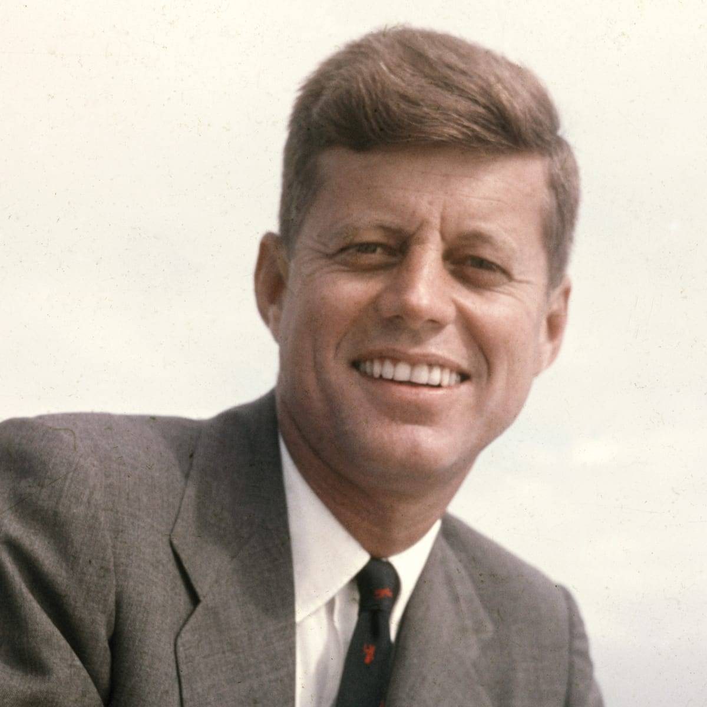

# John F Kennedy Biography

John F. Kennedy was America’s second youngest elected president. He oversaw one of the most crucial moments in the Cold War (Cuban Missile Crisis) and sought to affirm America’s beliefs in basic human rights by calling for civil rights legislation and an attempt to reduce poverty. Kennedy was assassinated on November 22, 1963 – a tragic death that shocked America and the world.
Born on May 1917, John F. Kennedy came from an illustrious political family; his father Joseph Kennedy was a leading member of the Democratic Party, and Joseph encouraged John F. Kennedy in his political ambitions after the war.
Before America joined the war, John joined the Navy and saw action throughout the Pacific theatre. In August 1943, his boat was rammed by Japanese destroyer Amagiri. John F Kennedy was later decorated for his outstanding bravery in rescuing a fellow crewman; he was also awarded the Purple Heart for an incident later in the war. Afterwards, Kennedy was modest about his actions, saying he felt a bit embarrassed as it resulted from a botched military action.
In 1946, he won a seat in Boston for the US House of Representatives, and in 1952 got himself elected to the US Senate, defeating the incumbent Republican.
In 1953, he married Jacqueline Lee Bouvier. In 1957 he was awarded the Pulitzer Prize for biography for his book Profiles in Courage, a book about US Senators who stood up for their personal beliefs.
In 1956, he was nearly chosen to be the Vice Presidential candidate for Adlai Stevenson. The national exposure raised his profile, and in 1960 he was selected to be the Democratic nomination for the Presidency.
Presidency
In 1960, in a very tight election, John F. Kennedy narrowly defeated the much-fancied Republican, Richard Nixon. It was a memorable election with many millions glued to the TV in the pre-election hustings. John F. Kennedy came across very well on TV and looked more relaxed and professional on camera.
It was the first time a Roman Catholic had been elected president and it was a big issue in America where many Protestants distrusted the prospect of America being influenced by the Vatican. He had to assure voters he was not a Catholic candidate for the Presidency, but someone standing for President who happened to be a Catholic.
During his inauguration, JFK gave a memorable speech, where he famously encouraged citizens to help the nation become strong again.
One of his early acts was to establish the Peace Corps – a volunteer programme run by the US government, it allowed young Americans to travel abroad and serve in developing countries. Kennedy hoped it would change foreign perceptions of Americans and give Americans a greater sense of international solidarity.
In 1961, after pressure from the CIA, Kennedy reluctantly ordered the Bay of Pigs invasion of Cuba. It was mostly led by Cuban exiles with minimal US support. They hope to overthrow the Communist Fidel Castro. However, the invasion was a failure leading to embarrassing negotiations with Fidel Castro’s Cuba. Despite been reluctant to go along with the policy, he accepted his responsibilty for its failure.
In 1962, figures in the US Department of Defense and Joint Chief of Staff proposed ‘Operation Northwoods’ which involved the CIA planning ‘false flag’ operations to stage attacks on US targets and claim Cuba was responsible – to create an opportunity to start a war against Cuba. Kennedy rejected the proposals but his reluctance to fully commit to removing Castro led to resentment amongst some CIA officers and Cuban exiles who felt Kennedy was insufficiently committed to removing Castro.

